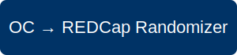

# OC to REDCap Randomizer Module

_Automates event‑triggered data sync, randomization, and allocation between OpenClinica and REDCap._

---

## ✨ Features
- Pulls configured OpenClinica fields after event completion
- Automatically inserts data into REDCap
- Performs REDCap randomization
- Pushes allocated value back into OpenClinica via API
- Full audit logging
- Institution-friendly configuration
- Open‑source and extensible

---

## 📦 Installation

### 1. Download the Module
Clone the repository or download a release ZIP.

### 2. Install into REDCap
Place the module directory inside:
